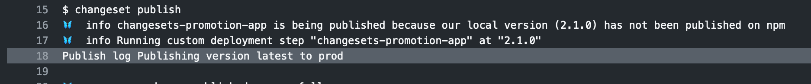

# changesets-promote

Example workflow for using GitHub actions with changesets to do continuous delivery

## How it works

It uses patch-package to apply a set of changes to @changesets/cli.

`app/package.json` contains a custom publish config for changesets

```
"changesets": {
    "publish": "./deploy.js"
}
```

A GitHub action for master always will deploy to dev

```
- name: Deploy to dev
    run: node ./app/deploy-cli.js
    env:
    TARGET_ENVIRONMENT: dev
    GITHUB_TOKEN: ${{ secrets.GITHUB_TOKEN }}
```

Then it runs a `Create Release Pull Request or Publish to npm` step.

This will open a pull request previewing the changes. 

When that PR is merged, the changes will be 'released' by changesets, running the custom deploy command for production.

## The result.

When a changeset is merged to master, it will automatically deploy to dev and open a PR to version packages


When that PR is merged the master build will run again, this time deploys prod as well.


